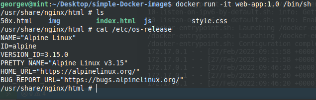

# Simple Docker image

I installed [Docker](https://www.docker.com/) on Linux, then I build my own docker image capable of running a simple game made by me with HTML, CSS, JavaScript in a web browser on top of a linux distribution base node.

My [Dockerfile](Dockerfile) is a multistage build. The base image is an *Alpine Linux* distribution from which is created first layer. There is copied the necessary web application files from local host into the working directory created inside the container. In the second stage is run the building of an *nginx* image where are pasted web files to serve the html file of application.

[.dockerignores](.dockerignore) is made for ignoring unnecessary files for building the image to be copied from local directory that contains the app.

The Docker image is build by  using images of Alpine and Nginx, then adding the files from local environment to run website application. Then run a container from the built image by exposing port 8080 externally and mapping to port 80 inside the container.  

`
docker build . -t web-app:1.0
`

`
docker run -d -p 8080:80 --name web_app web-app:1.0
`

By accessing from web browser with localhost and port created (*http://localhost:8080*), we can see the Nginx serves the html webpage of my app.

In next photo it is shown that my container runs on Alpine Linux:

Then I pushed in my [DockerHub](https://hub.docker.com/) the image created: 
`
docker tag web-app:1.0 george1v23/web-app
`

`
docker push george1v23/web-app
`

**Docker images used for build**

[**Alpine Linux**](https://alpinelinux.org/) is a Linux distribution built around _musl libc_  and _BusyBox_. The image is only 5 MB in size and has access to a package repository that is much more complete than other BusyBox based images. This makes Alpine Linux a great image base for utilities and even production applications.

[**Nginx**](https://www.nginx.com/) is an open source reverse proxy server for HTTP, HTTPS, SMTP, POP3, and IMAP protocols, as well as a load balancer, HTTP cache, and a web server (origin server). The nginx project started with a strong focus on high concurrency, high performance and low memory usage. It is licensed under the 2-clause BSD-like license and it runs on Linux, BSD variants, Mac OS X, Solaris, AIX, HP-UX, as well as on other *nix flavors. It also has a proof of concept port for Microsoft Windows.
